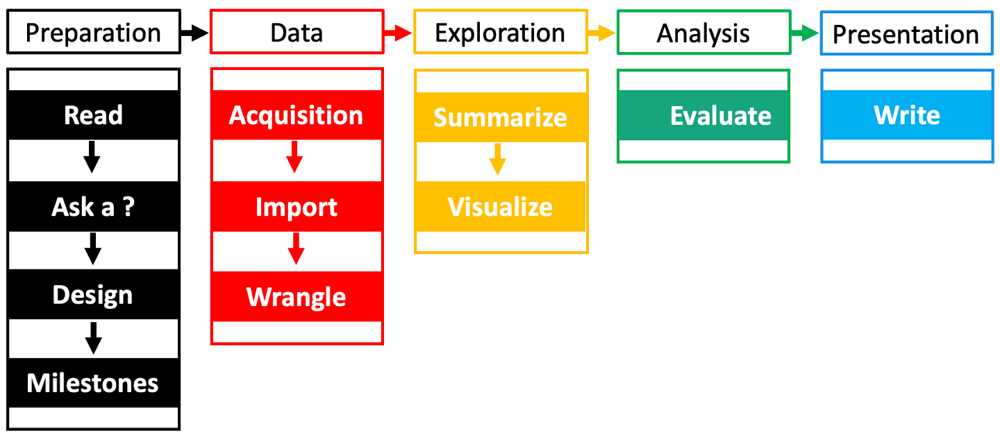

Scientific research is necessary because it helps provides solutions to many problems, from those found in everyday life to the mysteries of existence. It is used to build knowledge, teach, learn, and increase awareness through cutting edge technologies and techniques that create new ideas and that are born out of creativity and curiosity. "Social" science research focuses on humans, their interactions, and the societies they exist within and relies on data - forms of information - for it to work. 

While it is fun to discuss the postmodern constructs for the definition of data, in the context of this workshop it is defined as quantitative and qualitative representations of information about the world generally found through the senses and in the form of numbers, text, images, video, and audio. 

How then, might we approach a data-intensive computational social science research project? The example below is a simplified representation. 

## Ethical considerations

Begin to familiarize yourself with the many ethnical points to consider along with their real-world implications: 

* [Satz, D. 2023. Ethics and Data Science](https://datascience.stanford.edu/research/research-areas/ethics-and-data-science)
* [Stanford MSE234 Data Privacy and Ethics](https://web.stanford.edu/group/msande234/cgi-bin/wordpress/)
* [Danielak D. 2022. Designing a socially-critical data sciencen course](https://www.rstudio.com/conference/2022/talks/designing-socially-critical-data-science/)
* [RStudio, Data science ethics checklist](https://rpubs.com/njss/data_ethics)
* [SDS100 Lab10: Ethics](https://smithcollege-sds.github.io/sds100/lab_10_ethics.html)
* [EGAP Learning Days Module 10: Ethical Considerations](https://egap.github.io/theory_and_practice_of_field_experiments/ethical-considerations.html)]
* [UC Berkeley INFO88 Data and Ethics](http://www.data8.org/ethics-connector/)
* [Howard A, et al. 2017. Addressing bias in machine learning algorithms: A pilot study on emotion recognition for intelligent systems](https://ieeexplore.ieee.org/abstract/document/8025197?casa_token=xyJcglvpeyUAAAAA:_tpPmFLycMFQuTd4UC52Y2C5yxXignXv7OE1rgv01YwzOs2o9j_bMvIQPwD8IW2NT5awRJcl4g)
* [Noble S. 2018. Algorithms of oppression: How search engines reinforce racism](https://nyupress.org/9781479837243/algorithms-of-oppression/)
* [Yapo A and Weiss J. 2018. Ethical implications of bias in machine learning](https://aisel.aisnet.org/hicss-51/os/topics_in_os/6/)
* [Mehrabi N, et al. 2021. A survey on bias and fairness in machine learning](https://dl.acm.org/doi/abs/10.1145/3457607?casa_token=HkkFHCUfRh0AAAAA%3Az5PprDD4p2VDEyZD7KeJzl67tlpTTA48RsIlqcqDYLROEfyJMTzHRjdYYN8SheqDRkvt_H1XXojANQ)

## Preparation

- **Read** the relevant literature in your field. What questions are those authors asking, and in what directions do they suggest future research should go? What are the limitations and other problems? 
- **Ask a question** forged from your own interests combined with knowledge of the literature. You can cobble together a virtually endless supply of research questions with some creative thinking and a critical perspective. 
- **Design** your research framework. What type of question(s) are you asking, what are the assumptions of the data you seek and what are the expected outcomes? 
- Define **milestones.** When is your final deadline? Divide your project into subparts. Completing smaller goals will not only give you a sense of progress, but will also allow you to see how the parts connect together and will improve the quality of your work. 

## Data

* **Acquire** data. All projects require some form of data (again, theoretical musings aside), whether you obtain it from a government or other organization, use an API, scrape it from the web, or collect it yourself. 
* **Import** the data into R. As you can see, there is a lot of work to be done even before the computational part! Also, many questions that will arise will be related to the non-R parts. However, do not let this discourage you from experimenting with R! You will most definitely encounter many questions and error messages. 
* **Wrangle** your data to further ensure it is appropriate for the current question and project. Combined with your chosen statistical methods, the data should in some form be considered interpretable as a means to answer your research question. However, inconsistencies and other errors are inevitable, especially when compiling data from multiple sources. No dataset is perfect and some are better fit than others for your taask. 

Close visual inspection for errors is always a good first step, but you will likely spend much of your time fixing structural errors, standardizing names, handling missing values, dealing with non-normal distributions and outliers, and removing duplicate observations. You should always document your data wrangling process in the event you need to revisit your steps in the future. Your audience might be interested as well. 

## Exploration
* **Summarize** your data. A common misconception is that a researcher must incorporate complicated methods and artificial intelligence to produce meaningful results. Often-overlooked summary statistics can not only help cross-check your data wrangling, but can also elucidate patterns that can influence your assumptions about the expected outcomes. 
* **Visualize** aspects of your data. The goal of data visualization is to communicate some aspect of your data to an audience in a clear and concise way. 

## Analysis and interpretation
* **Analyze** your results by the suitable methods you have chosen. This could mean various forms of data acquisition, merging, and aggregation; exploration, inference, and other forms of estimation, prediction, and hypothesis testing. **Interpret** your results in the Discussion section to inform your audience how the framework justifies the results, but also how results relate back to the entire research framework. Don't forget to mention potential shortcomings in your overall research approach, methods, analysis, etc. You should also mention where research could/would/should go from here. 

## Presentation
* **Effective communication** of your research is equally important as exciting results. Whether you are presenting a slideshow to colleagues, poster, conference talk, webinar, or submitting a manuscript for peer-review, effective communication of your subject matter is just as important as exciting results and takes a lot of practice.  
