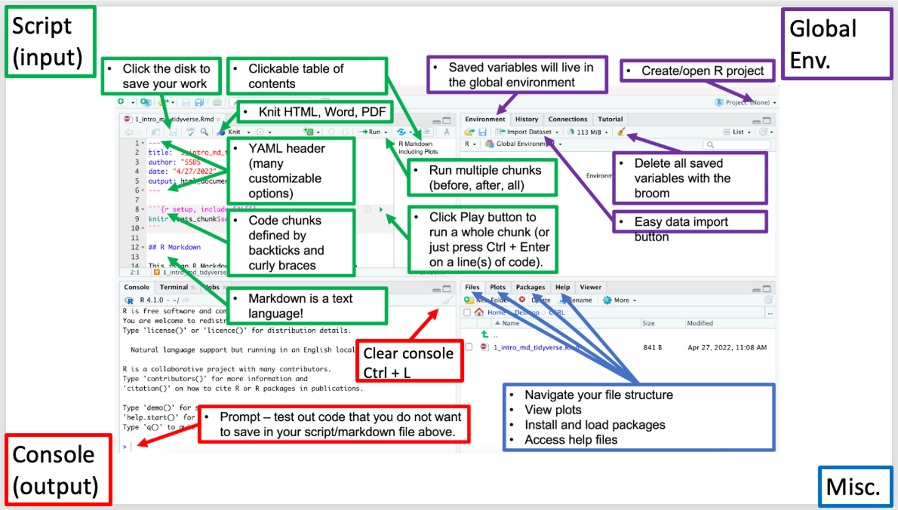

## Why R?

R is the programming language we will use. Think of it as a way to give instructions to our computer for data-related tasks. 

R is an appropriate tool the computational parts of the research process. It is a free (for us to use, but not necessarily to develop!) and open programming language that helps you interact with a computer to perform data science tasks. Note that R was designed to do statistics/data science from its conception and has evolved that way. 

## Why RStudio?

* RStudio is the environment that we will program R inside of and contains many helpful features.  

* RStudio is the graphical user interface/environment that we will program R inside of. It is really helpful for staying organized and offers much more functionality than the R language provides by itself. RStudio is also highly customizable. [Read the customization guide by clicking here](https://support.rstudio.com/hc/en-us/articles/200549016-Customizing-the-RStudio-IDE).

## Source files

We enter instructions for our data-related tasks in an R source file. These source files usually take the form of an 1) R script or 2) RMarkdown file. 

### R script

R scripts are simply plain text files with a .R file extension. Click `File --> New File --> R Script` to open one. In R scripts:  
- Code is entered normally  
- Hashtags `#` are used to comment your code, enter text, or otherwise make notes to yourself and collaborators.  
- Open a new script and enter `2 + 2`. Then, place your cursor anywhere on that line of code and press the `control` and `enter` keys simultaneously to run it!  

We will also discuss RMarkdown as an alternative to R scripts as well as R Projects to help keep everything organized. 

## Navigating RStudio

> Note: the green text boxes for the "Script (input)" window apply to RMarkdown (more on this later).  
> For now, you can just enter your code and hashtags normally in a plain R script!