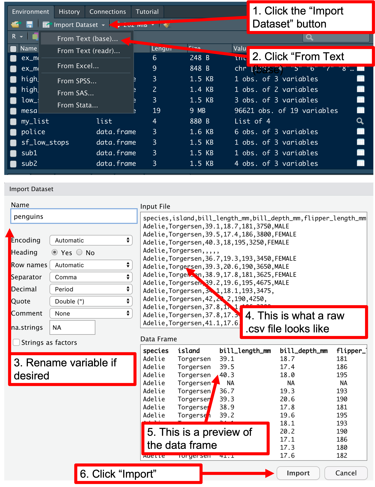

# R basics

Use R building blocks in creative ways to tackle any task! The challenge is arranging them in creative and specific ways to accomplish your goals. 

## Basic building blocks of R programming

Several vocabulary/jargon terms will help you begin to understand how R works!  

1. Everything that exists in R is an **object** or some piece of information/data that can be manipulated. All objects have a class, or type, that determines how the data can be wrangled and shaped. 
2. Almost everything that happens is a **function call**, or a command that performs an action on a "thing". Functions frequently contain trailing round parentheses `()`, such as in `mean()`. 
3. The "things" we give to functions are called **arguments** and are defined in function creation as **parameters**, or placeholders that receive arguments we pass into them.
4. **Variables** (which are also objects) are how data are saved in R's memory, which lives in a physical location on your computer. Variables can contain virtually anything: values, mathematical expressions, text, functions, or entire datasets. 
5. `<-` is the assignment operator. It assigns values on the right to objects on the left. So, after executing `x <- 5`, the value `5` is saved inside of the variable `x`.  
  * You can read this in plain language as "x is defined as 5", "5 is assigned to x", "x is equal to 5", or most simply "x is 5".  
  * This performs the assignment step. Note that the variable now appears on your "Environment" tab.  

## Running code

Open a new R script by clicking "File" --> "New File" --> "R Script". Save it and then copy/paste the below code. Click a line of code and on your keyboard press `ctrl` and `enter` keys simultaneously. This is how you will tackle challenge questions during the bootcamp. 

Note that no output is displayed on the screen during the assignment step. Type the name of the variable and run it ("call" the variable) to show the output in the console. 

```{r}
x <- 5
x
```

## Data types: numeric, character, logical, integer, factor

Like everything else in R, data have a class (type) associated with it which determines how we can manipulate it. Use the `class()` function to find out. The variable `x` is the argument. We will talk about five basic types: 

1. Numeric: decimals; the default class for all numbers in R
2. Character: text, always wrapped in quotations `" "` (single or double are fine, be consistent)
3. Logical: TRUE and FALSE; stored internally as 1 and 0 and as such take on mathematical properties; useful for turning function parameters "on" or "off", as well as for data subsetting (see below).
4. Integer: positive and negative whole numbers, including zero
5. Factor: categorical data

1. Numeric  

```{r}
class(x)
```

2. Character

```{r}
# use a hashtag within a code chunk to comment your code
# note the use of the underscore to represent a space in the variable name
my_name <- "Nerd Squirrel"
my_name
class(my_name)
```

3. Logical

```{r}
class(TRUE)
class(FALSE)
TRUE + 1
FALSE - 1

# is 3 greater than 4?
3 > 4

# is 4 less than or equal to 4?
4 <= 4

# is "Apple" equal to "apple" (hint: R is case sensitive!)
"Apple" == "apple"

# is "Apple" not equal to "Apple"
"Apple" != "Apple"
```

4. Integer

We can use various "as dot" functions to convert data types. To convert numeric to integer class for example, we could type: 

```{r}
y <- as.integer(x)
y
class(y)

# or
y2 <- 8L
y2
class(y2)
```

5. Factor

Other "as dot" functions exist as well: `as.character()`, `as.numeric()`, and `as.factor()` to name a few:

```{r}
school <- "Stanford University"
school
class(school)

# convert to factor
school_fac <- as.factor(school)
school_fac
class(school_fac)
```

It might seem difficult keeping track of variables you define, but remember they are listed in RStudio's "Environment" tab. You can also type `ls()` to print them to the console. 

```{r}
ls()
```

You can also use `dir()` to view the contents of your working directory (aka the physical location in R's memory on your computer, that your RStudio loads from and saves to by default). 

Remove a single variable with `rm()`

```{r eval = F}
dir()
rm(my_name)
my_name # Error
```

> Remember to use autocomplete when typing a function or variable name, since there is great potential for humans to make syntactical errors

Alternatively, you can wipe your Environment clean by clicking the yellow broom icon on the Environment tab or by typing

```{r}
rm(list = ls())
```

If your environment gets too messy, pressy `ctrl + l` to return the prompt to the top and make it more readalble. This also makes scrolling through your output much easier!

> To completely restart your R session, click "Session" --> "Restart R" from the top toolbar menu. 

## Data structures: vector, data frame

### Vector

If saving one piece of data in a variable is good, saving many is better. Use the `c()` function to combine multiple pieces of data into a **vector**, which is an ordered group of the same type of data. 

We can nest the `c()` function inside of "as dot" functions to create vectors of different types. 

```{r}
# example numeric (default) vector
traffic_stops <- c(8814, 9915, 9829, 10161, 6810, 8991)

# Integer, logical, and factor vectors
city <- as.factor(c("SF", "DC", "DC", "DC", "SF", "SF"))
year <- as.integer(c(2000, 2000, 2001, 2002, 2001, 2002))

# Call these variables to print them to the screen and check their class
traffic_stops
city
year

class(traffic_stops)
class(city)
class(year)
```

### Data frame

A **data frame** is an ordered group of **equal-length** vectors. 

> More simply put, a data frame is a tabular data structure organized into horizontal rows and vertical columns, i.e. a spreadsheet! These are often stored as comma separated values (.csv) files, or plain text where commas are used to delineate column breaks and that look good in spreadsheet programs like Microsoft Excel. 

We can assemble our three vectors from above into a data frame with the `data.frame()` function. 

```{r}
police <- data.frame(city, traffic_stops, year)
police
class(police)

# display the compact structure of a data frame
str(police)
# class = data.frame
# 6 observations (rows)
# 3 variables (columns, or vectors)
# column names are preceded by the dollar sign 
```

# Challenge 1 - dataframes

1. Open a new script a create a dataframe that contains 6 rows and 3 columns by following the instructions above.

2. Advanced: what is the difference between a data frame and a tidyverse tibble? 

# Break

# Data wrangling and reshaping

## Indexing

A vector can be indexed (positionally referenced) by typing its name followed by its index within square brackets `[]`. For example, if we want to index just the first thing in the "city" vector, we could type

```{r}
city[700]
# or
police$traffic_stops
```

If we want to return just the third element in traffic_stops, we would type

```{r}
traffic_stops[3]
# or
police$traffic_stops[3]
```

> Note that R is a "one-indexed" programming language. This means that counting anything starts at 1.

## `$` single column subsetting

Note that columns are preceded by the dollar sign `$`. You can access a single column by typing the name of your data frame, the `$`, and then the column name. Note that autocomplete works for much more than just function and variable names!

```{r}
# show just the column containing the number of traffic stops
police$traffic_stops

# ... which can then easily be plugged into another function
hist(police$traffic_stops)
```

> Click and drag your plotting area to make it larger if you receive the error message "Error in plot.new() : figure margins too large"

## `[,]` Bracket notation subsetting

This can also be extended to rows and columns using bracket notation `[,]`

Type the name of your data frame followed by square brackets with a comma inbetween them. 

Here, we can enter two indices: one for the rows (before the comma) and one for the columns (after the comma) like this: `[rows, cols]`

For example, if we want two columns, we cannot use the dollar sign operator (since it only works for single columns), but we could type either the indices or the columns names as a vector! 

If either the row or column position is left blank, all rows/columns will be retured becuase no subset was specified. 

To subset the `police` with just the city name and number of stops columns, type

```{r}
city_and_stops <- police[,c(1,2)]
city_and_stops
# or, use the colon operator for consecutive sequences
5:10
city_and_stops <- police[,1:2]
city_and_stops
# or using variable names
city_and_stops <- police[ ,c("city", "traffic_stops")]
city_and_stops
```

> Keep in mind that redefining a variable will overwrite it each time, as we are doing here. 

We can do the same thing for rows by adding a vector of the row indices to include. For example, to keep just rows 1, 2, and 3 along with columns "city" and "traffic_stops" we could type: 

```{r}
subset1 <- police[1:3, c("city", "traffic_stops")]
subset1
```

Or, to keep rows 1, 2, and 4 along with "city" and "traffic_stops" columns:

```{r}
subset2 <- police[c(1,2,4), c("city", "traffic_stops")]
subset2
```

Subset by logical condition by using the logical operators discussed above: `==`, `>`, `<=`, etc.

For example, if you want to subset only rows with stops less than 9000 you would combine the dollar sign operator along with bracket notation. 

This performs a row subsetting operation based on the condition of a column. Note that the column position is left blank after the comma to indicate all columns should be retured.

```{r}
low_stops <- police[police$traffic_stops < 9000, ]
low_stops
```

Or, to include multiple conditions use logical and `&` (all conditions must be satisfied) and logical or `|` (just one condition must be satisfied). 

To subset just rows that contain SF as the city and stops less than 7000, type

```{r}
sf_low_stops <- police[police$city == "SF" & 
                         police$traffic_stops < 7000, ]
sf_low_stops
```

# Challenge 2 - subsetting

1. Open a new script a create a subset that contains data from DC or stops less than or equal to 7000 and just columns "city" and "traffic_stops"

2. Advanced: use the `filter()` and `select()` functions from the `dplyr` R package to do the same thing (hint: see the dplyr section below!)

## Lists and matrices (optional)

### List

Lists are R objects that can contain heterogenous types (remember that a vector can only contain data of the same type). For example: 

```{r}
my_list <- list("Grapefruit", TRUE, "Nerd Squirrel", c(3.14, 2.13, 1.45))
my_list
```

You can also name the list elements:

```{r}
names(my_list) <- c("one_food", "logical_value", "name_of_something", "vector_of_-stuff")
my_list
```

Remember the dollar sign operator `$` we used above to extract just a single column from a data frame? This actually comes from lists! We can index only the "name" filed from our list like: 

```{r}
my_list$name
```

### Matrix

A matrix is similar to a data frame but can only contain data of a single type. Matrices are often used in mathematical calculations. While data frames are restricted to two dimensions (rows and columns), matrices can be of _n_-dimensions. 

```{r}
ex_matrix <- matrix(4:9, ncol = 2)
ex_matrix
class(ex_matrix)
class(ex_matrix[1])

# What happened to our numbers in the presence of a single character data element?
ex_matrix2 <- matrix(c(4, 5, 6, 7, 8, 9, 10, 11, "pizza"), ncol = 3)
ex_matrix2
class(ex_matrix2[1])
```

## Finding help

To call R's help pages and see how a function is used, in your console type a question mark before a function name.  

Read the **Description** section to learn what the function does. See the **Usage** section to see which parameters belong to the function. Check out the **Arguments** section to see the rules for each argument! Often included (but not always) below these sections are **Details** that offer more information, **Value** that describes a function's output, **Notes**, **Authors**, **References** and copy/paste **Examples** to experiment with. 

```{r eval = F}
?data.frame # help with the data.frame() function
?mean # arithmetic mean
?hist # histogram
?lm # look at help pages for linear regression
?glm # generalized linear models
?shapiro.test # perform normality test
?">" # Wrap symbols in quotations to view their help files
?"&"
```

Other helpful debugging tools/strategies:  
1. Googling the error text, and referring to a forum like StackOverflow. You can also prompt a search engine with a "how-to" question, such as"R ggplot2 how to make scatterplot", for example. 
2. (IDE-dependent) Placing breakpoints in your program and using the debugger tool to step through the program  
3. Strategically place print() statements to know where your program is reaching/failing to reach  
4. Ask a friend! A fresh set of eyes goes a long way when you’re working on code.  
5. Restart your IDE and/or your machine.  
6. [Schedule an SSDS consultation](https://library.stanford.edu/research/software-and-services-data-science/schedule-consulting-appointment-contact-us)

# The dplyr and tidyr R packages

Subsetting with the dollar sign operator `$` and bracket notation `[ , ]` is incredibly useful, but you will inevitably encounter major roadblocks when performing more complex operations. Thankfully, the [tidyverse](https://www.tidyverse.org) was created in part to alleviate the many frustrations of using base R data wrangling methods. 

## Package installation

Although your base R installation comes with many helpful features, many R users have written packages (i.e., additional software add-ons to R) that include shortcuts to helpful functions we would have to otherwise write ourselves. This is time saving since R packages exist for complicated tasks in virtually every field of study. 

Package installation exists in two steps: 
1. Use the `install.packages()` function to physically download the files to your computer. 
2. However, your current RStudio session does not know that these files exists. Use the `library()` function to link the downloaded files to your current session. For example: 

```{r}
# Step 1. Physically download the dplyr and tidyr files
install.packages("dplyr")
# install.packages("tidyr")

# Step 2. Link these files to your current session
library(dplyr)
library(tidyr)
```

## Essential dplyr functions

Several dplyr functions will help us quickly subset data. 
1. `filter()` - filter rows based on a condition
2. `select()` - select certain columns
3. `group_by()` - perform grouping operations
4. `summarize()` - create a new dataframe that summarizes each group to a single row (e.g., group means and standard deviations)
5. `mutate()` - create, modify, and delete columns OF AN EXISTING data frame

However, our operations will be based on pipes `%>%`, that tell R to take the thing on the left of the pipe and insert it into the thing on the right. 

How does it work? 

1. We generally want to create a new varible, so you will be performing **variable assignment.**
2. Type the name of your dataset (`police`) followed by the pipe symbol.
3. Type the name of the `filter()` function, and insert a condition in the parentheses. 
4. Add an additional pipe at the end of step 3 above if you want to add more functions. 

### `filter()`

For example, to filter only rows in `police` with stops greater than 10000: 

```{r}
high_stops <- police %>%
  filter(traffic_stops > 10000)
high_stops
```

## `select()`

Or, to filter only rows in `police` with stops greater than 10000 and select only the "traffic_stops" and "city" column:

```{r}
high_stops2 <- police %>%
  select(city, traffic_stops)
high_stops2
```

We can add multiple conditions such as logical and `&` and or `|`
  * Logical and `&` posits that all conditions must be satisfied to be included in the subset. 
  * Logical or `|` positits that just one of multiple conditions needs to be satisfied to be included in the subset. 

What if we want only rows from `police` returned that were less than 9000 AND occurred in the year 2002?

```{r}
sub1 <- police %>%
  filter(traffic_stops < 9000 & year == 2002)
sub1
```

How about if we want only rows from `police` returned that were less than 9000 OR occurred in the year 2002? Do you think we will get more or less rows returned? Why?

```{r}
sub2 <- police %>%
  filter(traffic_stops < 9000 | year == 2002)
sub2
```

### `group_by()` and `summarize()`

dplyr also makes it easy to quickly create summary statistics!

```{r}
city_mean_sd <- police %>%
  group_by(city) %>%
  summarize(stops_mean = mean(traffic_stops), 
            stops_sd = sd(traffic_stops))
city_mean_sd
```

# Challenge 3 - `group_by()` and `mutate()`

While `summarize()` will create a new tibble, `mutate()` creates a new column(s) in an existing tibble. 

Open a new script and use the help file for the `mutate()` function that, combined with `group_by()`, creates a new column that computes the average stops per year for the `police` dataframe. (hint: assume there are 365 days in a year!)

# Importing tabular data

Importing data can be fairly straightforward thanks to R's syntax and the clickable buttons inside RStudio. Import the "penguins.csv" file using the code below. A .csv file ("comma-separated values") is a text file where information is stored and where columns and rows are indicated by positions of the commas, thus it is easy converted to a data frame! 

```{r}
penguins <- read.csv("data/raw/penguins.csv")
head(penguins) # show first 6 rows by default
str(penguins)  # show compact structure: class, nrow, ncol, column names and types, and examples of the data
nrow(penguins) # number of rows
ncol(penguins) # number of columns
dim(penguins)  # number of rows by columns
sum(is.na(penguins)) # total number of missing values
sum(is.na(penguins)) / (nrow(penguins) * ncol(penguins)) # calculate % of missing data for the dataset
```

Alternatively you can click the "Import Dataset" button as in the screenshot below!



# Challenge 4 - .txt import

1. Import the "frankenstein.txt" file. Save it in a variable named `frank`

## The tidyr package

However, data are not always nicely formatted for exploration and analysis. This means that before we clean and subset data, we actually have to reshape it first. We often want the format to be [tidy](https://cran.r-project.org/web/packages/tidyr/vignettes/tidy-data.html), which makes the data ready for summarization, visualization, and analysis. Check out the [Carpentries lesson on data formats to learn more](https://swcarpentry.github.io/r-novice-gapminder/14-tidyr/index.html). 

Signs of messy datasets
- Column headers are values, not variable names.
- Multiple variables are not stored in one column.
- Variables are stored in both rows and columns.
- Multiple types of observational units are stored in the same table.
- A single observational unit is stored in multiple tables.

Let's take a look at one example using `dplyr` and `tidyr`.

```{r}
library(dplyr); library(ggplot2); library(tidyr)
gap_wide <- read.csv("data/raw/gapminder_wide.csv")
head(gap_wide)

gap_long <- gap_wide %>% 
  gather(key   = obstype_year,
         value = obs_values,
         -continent, -country) %>%
  separate(obstype_year,
           into = c('obs_type','year'),
           sep = "_",
           convert = TRUE)
str(gap_long)
head(gap_long)
tail(gap_long)

# Plot Japan's gdpPercap by year
japan <- gap_long %>%
  filter(obs_type == "gdpPercap",
         country == "Japan")

ggplot(japan, aes(x = year, y = obs_values)) + 
  geom_line() + 
  theme_minimal()

# Or, multiple countries in a group 
gdp_oceania <- gap_long %>%
  filter(obs_type == "gdpPercap",
         continent == "Oceania")
library(ggplot2)
ggplot(gdp_oceania, aes(x = year, 
                         y = obs_values, 
                         color = country)) +
  geom_line() + theme_minimal()
```

# Working with text data

R allows you to easily manipulate and subset strings in a variety of ways. Instead of getting lost in the weeds, below is a high level overview for importing, preprocessing, and analyzing text. 

1. Specify the location of your texts. We have two .txt files in the "novels" subfolder. 

```{r}
dir_of_texts <- file.path("data/raw/novels/")
head(dir_of_texts)
dir(dir_of_texts)
```

2. Read the txt files into a standardized format like a data frame

```{r}
# install.pacakges("readtext")
library(readtext)
texts_df <- readtext::readtext(dir_of_texts)
texts_df
```

3. Convert the dataframe into a corpus object

```{r}
# install.packages("tm")
library(tm)
corpus <- tm::Corpus(tm::VectorSource(texts_df))
corpus
glimpse(corpus)
```

4. Preprocess the text!
```{r}
# install.packages("stm")
library(stm)
clean_corpus <- stm::textProcessor(documents=texts_df$text,
                                 # metadata = texts_df$doc_id,
                                 lowercase = TRUE, #*
                                 removestopwords = TRUE, #*
                                 removenumbers = TRUE, #*
                                 removepunctuation = TRUE, #*
                                 stem = TRUE, #*
                                 wordLengths = c(3,Inf), #*
                                 sparselevel = 1, #*
                                 language = "en", #*
                                 verbose = TRUE, #*
                                 onlycharacter = TRUE, # not def
                                 striphtml = FALSE, #*
                                 customstopwords = NULL, #*
                                 v1 = FALSE) #*
clean_corpus
```
                                 
5. Fit a topic model

```{r}
st_model <- stm::stm(documents = clean_corpus$documents, 
                     vocab = clean_corpus$vocab,
                     K = 2,
                     max.em.its = 75,
                     data = clean_corpus,
                     init.type = "Spectral")
st_model
```

Who is Hawkin and where is Piccadilli? What about Elizabeth and Geneva? 

```{r}
stm::labelTopics(st_model)
```

Call `?stm::labelTopics` to see what Highest Prob, FREX, Lift, and Score mean.

# Lunch

# Data visualization with ggplot2

[ggplot2 is a system for declaratively creating graphics, based on The Grammar of Graphics. You provide the data, tell ggplot2 how to map variables to aesthetics, what graphical primitives to use, and it takes care of the details.](https://ggplot2.tidyverse.org/)

Requirements for ggplot2 ggplot
1. Layers to control different aspects of the plot (coordinates, shapes and colors mapped from data, )
2. The `+` symbol to connect different layers
3. Data to be mapped
4. Geoms to tell R how the data should be represented (points, bars, lines, etc)
5. Themes for customizing scales, axes, labels, and much more

## Histogram

Histograms can be used to visualize variable distributions. The x-axis tells us how many observations have a value within a particular range, which is specified on the y-axis. 

### `hist()`

```{r}
hist(penguins$body_mass_g)
```

### `geom_histogram()`

```{r}
library(ggplot2)
ggplot(data = penguins, aes(x = body_mass_g)) +
  geom_histogram()

# note the error message! Try adjusting bins = 
ggplot(penguins, aes(x = body_mass_g)) +
  geom_histogram(bins = 5)
```

## Boxplot

Boxplots are also used to visualize variable distributions, but with more information attached.

### `boxplot()`

```{r}
boxplot(penguins$body_mass_g)

# or by a grouping variable
boxplot(penguins$body_mass_g ~ penguins$species)
```

### `geom_boxplot()`

```{r}
ggplot(penguins, aes(x = species, 
                     y = body_mass_g)) +
  geom_boxplot() +
  theme_bw()
```

## Bar chart

### `geom_col()`

```{r}
# create table of means with dplyr::summarize
library(dplyr)
(bmg_means <- penguins %>%
  group_by(species) %>%
  summarize(mean_bmg = mean(body_mass_g, na.rm = TRUE)))

# plot
ggplot(bmg_means, aes(x = species, 
                      y = mean_bmg)) + 
  geom_col() +
  theme_bw() +
  scale_y_continuous(limits = c(0, 6000), 
                     breaks = c(0, 1000, 2000, 3000, 4000, 5000, 6000))
```

## Scatterplot

Scatterplots can be used to look at the relationships of two continuous variables.

### `plot`

```{r}
plot(x = penguins$flipper_length_mm, 
     y = penguins$bill_length_mm)
```

### `geom_point()`

```{r}
ggplot(penguins, aes(x = flipper_length_mm, 
                     y = bill_length_mm, 
                     color = species)) +
  geom_point() + 
  theme_minimal()
```

### `geom_jitter()`

Jittered points can be used when you seek to make a scatterplot but with a discrete-ish variable...

What is the difference between the below two plots?

```{r}
A <- ggplot(penguins, aes(x = flipper_length_mm, 
                          y = island)) +
  geom_point() + theme_bw() +
  xlab("Flipper Length (mm)")

B <- ggplot(penguins, aes(x = flipper_length_mm, 
                          y = island)) +
  geom_jitter(height = .1) + theme_bw() + 
  xlab("Flipper Length (mm)") + ylab("")

# install.packages("patchwork")
library(patchwork)
(A + B)
```

# Challenge 5 - line plot

1. Use `geom_line()` to create a line plot of mean lifeExpectancy through time FOR EACH CONTINENT using the gap dataset loaded below. Before plotting however, use dplyr to pipe in your `group_by()` and `summarize()` functions directly into ggplot. 
```{r}
gap <- read.csv("data/raw/gapminder-FiveYearData.csv")
```
# Exploratory data analysis

Whether before or after you visualize, it is usually good to crunch some actual numbers as a companion to whichever visualizations you produce. 

## Summary statistics

Summarize your data in terms of its measures of central tendency and dispersion, skew, kurtosis, etc. 

### `mean()`, `sd()`, and `median()`

```{r}
gap <- read.csv("data/raw/gapminder-FiveYearData.csv")
mean(gap$lifeExp)
sd(gap$lifeExp)
median(gap$lifeExp)
```

## Principal component analysis

[Let's go through the STHDA PCA methods in R practical guide together](http://www.sthda.com/english/articles/31-principal-component-methods-in-r-practical-guide/112-pca-principal-component-analysis-essentials/)

# Challenge 6 - summary statistics

1. Install and library the "psych" package and call the help file `?describeBy` to see how to produce this function's default summary statistics as grouped by continent.

# Break

# Hypotheses, p-values, and confidence intervals

After acquiring, importing, wrangling, and exploring/visualizing data, you may want to formally test parts of your data differences between groups, relationships among variables, etc. Remember that we only show how they work in R here - seeing if your data fits the assumptions of a given test is your responsibility! [Schedule an SSDS consultation if you have questions about hypotheses, or anything else covered in this bootcamp!](https://library.stanford.edu/research/software-and-services-data-science/schedule-consulting-appointment-contact-us)

* [Null and alternate hypoteses - easy explainer](https://stackoverflow.com/questions/30420892/null-and-alternative-hypothesis)
* [Using confintr](https://cran.r-project.org/web/packages/confintr/vignettes/confintr.html)
* [P-value functions: Tutorial using the pvaluefunctions package](https://cran.r-project.org/web/packages/pvaluefunctions/vignettes/pvaluefun.html)

## Tests

Thankfully, R easily calculates these statistics for us in many testing scenarios. 

### `t.test()`

```{r}
f_penguins <- penguins %>% filter(sex == "FEMALE")
m_penguins <- penguins %>% filter(sex == "MALE")
t.test(x = f_penguins$body_mass_g, 
       y = m_penguins$body_mass_g)
```


### `aov()`

```{r}
penguins_aov <- aov(body_mass_g ~ species, data = penguins)
summary(penguins_aov)
TukeyHSD(penguins_aov)
```


### `cor.test()`

```{r}
cor.test(penguins$body_mass_g, penguins$flipper_length_mm)
```


### `lm()`

```{r}
penguins_lm <- lm(body_mass_g ~ flipper_length_mm, data = penguins)
summary(penguins_lm)
```

# Presenting your research

## R projects

* [Click this text to read about Projects in RStudio](https://bookdown.org/ndphillips/YaRrr/projects-in-rstudio.html)

1. Create a new R Project named `targets_test`
2. Inside of this project directory you will see the `targets_test.Rproj` file. Also add:
  * The penguins.csv file by copy/pasting it from your bootcamp data/raw folder
  * Create a folder named "R"
  * Inside of the "R" folder, add a script named `functions.R`. Copy/paste the below code: 
  
```{r eval = F}
fetch_data <- function(file) {
  read_csv(file, col_types = cols()) %>%
    as_tibble()
}

fit_model <- function(data){ 
  lm(flipper_length_mm ~ bill_length_mm, data) %>%
    coefficients()
  }

plot_model <- function(model, data){
  ggplot(data) + 
    geom_point(aes(x = flipper_length_mm, 
                   y = bill_length_mm)) + 
    geom_abline(intercept = model[1], slope = model[2]) + 
    theme_bw()
}
```

3. Enter the below code in your `targets_test` console to:  to load the requisite libraries and source the functions. 

```{r eval = F}
# load libraries
library(dplyr); library(ggplot2); library(targets); library(tibble); library(readr)

# source functions to 1) fetch data, 2) fit a linear model, and 3) plot the results
source("R/functions.R")

# define the moving parts
file <- "penguins.csv"
data <- fetch_data(file)
model <- fit_model(data)
figure <- plot_model(model, data)

# create the targets file
targets::use_targets()
```

4. Let's create and edit the `_targets.R` file together. Run `tar_make()`. What happened? (hint: the output is inside of the "_targets/objects" folder!) 

## R Markdown

The bootcamp materials were written in R Markdown and allow us to convert our code and text to various document formats such as HTML, MS Word, PDF, and ioslides. Remember: 
* Text is entered normally
* Code should be entered in chunks

```{r}
# hashtags work normally inside of code chunks
```

* [Click this text to open the R Markdown Reference Guide](https://www.rstudio.com/wp-content/uploads/2015/03/rmarkdown-reference.pdf) 
* [Click this text to open the R Markdown cheatsheet](https://posit.co/wp-content/uploads/2022/10/rmarkdown-1.pdf)

## Dashboards with the "flexdashboard" package

* [Let's walkthrough the Flexdashboard documentation together!](https://pkgs.rstudio.com/flexdashboard/)

## Writing tips

* [Mensh B and Kording K. 2017. Ten simple rules for structuring papers](https://journals.plos.org/ploscompbiol/article?id=10.1371/journal.pcbi.1005619)

## `save()` and `load()` 

Save only only variables and functions you want in an "R.Data" file with the `save()` function like so:

```{r eval = FALSE}
save(penguins, gap_long, file = "data/preprocessed/2023May12_penguins_gap_long.RData")
```

Now, wipe your global environment clean! Load _only_ the saved variables with `load()`

```{r}
load("data/preprocessed/2023May12_penguins_gap_long.RData")
```


# Wrap-up


```{r klippy, echo=FALSE, include=TRUE}
klippy::klippy()
```