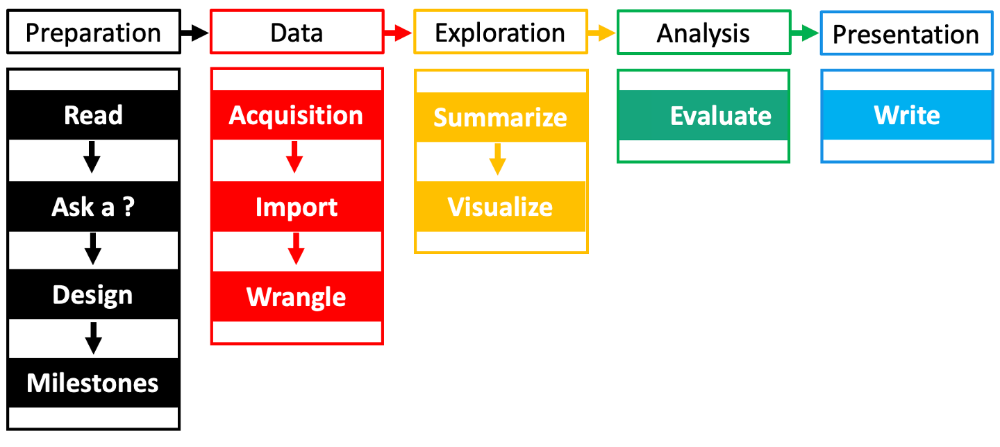
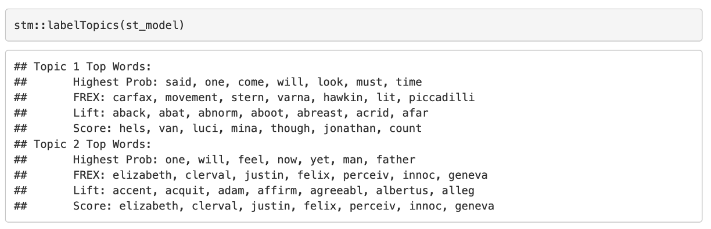

# Welcome to the 2023 SSDS R Bootcamp at Green Library 

## Pre-workshop installations
1. [Click this text to visit R download R webpage](https://cloud.r-project.org/)
2. [Click this link to go to the RSutio download webpage](https://posit.co/download/rstudio-desktop/)
3. Download these materials. Visit: https://github.com/EastBayEv/R_bootcamp
* Click the green "Code" button then click "Download ZIP". 
* Windows users right click the installer file and select "extract here". Mac users can double click the file. 
> git users can simply `git clone` this repository  

## Start exploring
Open the first three .html files: 
* 1_Agenda.html - outline of the topics to be covered
* 2_Workflow.html - illustrates the basic moving parts of data-centric research workflows
* 3_Navigating_RStudio.html - Learn your way around RStudio by getting familiar with essential windows and buttons

## Run the code
Open "R Bootcamp.Rproj" to boot your RStudio. Click the "Files" tab on the right side of the screen and click on "4_tutorial.Rmd"

Don't worry about the strange formatting for now. Place your cursor on line 38 `x <- 5` and click the "Run" button or press <kbd>Ctrl</kbd> + <kbd>Enter</kbd> on your keyboard. Then run line 39 and see if you can spot the output on the screen. 

### Dracula and Frankenstein
Along with many other things, you'll learn a basic topic modeling workflow to begin to understand how abstractions are generated from unstructured text. Can you spot any distinctive words in the screenshot below?

## Challenge questions and solutions
You will be prompted to apply what you learn by seven challenge questions. Open 5_Solutions.Rmd to run the solutions.

## Resources
View 6_Resources.html for many useful resources.
